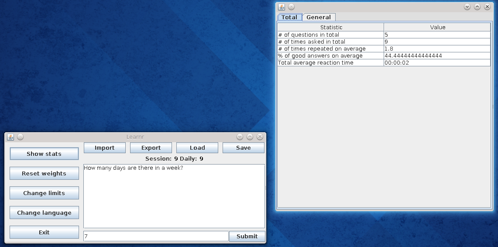

= Learnr -- README

== Basic information

Learnr was created by Ondrej Skopek as part of the
https://is.cuni.cz/studium/garantlink.php?glogin=false&gmodul=predmety&gscript=redir.php&redir=predmet&kod=NPRG030[NPRG030]
course taken at the http://mff.cuni.cz[Faculty of Mathematics and Physics] of https://cuni.cz[Charles University]
and is licensed by the http://opensource.org/licenses/MIT[MIT license].
_For educational reasons, no contributions are accepted at this time._

This project currently resides in it's own https://github.com/oskopek/learnr[repository at GitHub].

== Quick start

If you have an assembled distribution of Learnr (that contains an executable jar), follow these steps to get "up and learning" quickly:

* Download a sample dataset from the https://github.com/oskopek/learnr/tree/master/data/import_export[GitHub repository's data folder]
  and save it in an accessible local folder.
* Run the executable jar: `java -jar learnr-jar-with-dependencies.jar` or double-click in the file manager.
* _Optional_: Change to the language of your choice -- click the _Change language_ button.
* Import the downloaded sample dataset by clicking the _Import_ button.
* Answer the questions, view your statistics, and have fun! (Don't forget to save your progress using the _Save_ button).

== How to run

Make sure you have installed the following prerequisites:

* Maven (>=3.0.0)
* Java (JDK) (>=1.7)

Example maven commands:

* To clean: `mvn clean`
* To build: `mvn compile`
* To run: `mvn exec:java`
* To build an executable jar: `mvn package`
* To run the executable jar: `java -jar path/to/jar/file/learnr-jar-with-dependencies.jar`

== Loading/Saving & Importing/Exporting

These four words have exact (and different) meanings in Learnr:

* Load/Save -- used for loading and saving a dataset *with* the statistics
* Import/Export -- used for loading and saving a dataset *without* the statistics -- mainly for distribution of dataset files

== Sample datasets (and where to find them)

The sample datasets are not distributed as a part of this project. You can find them in the `data/import_export` folder in the project root.
See https://github.com/oskopek/learnr/tree/master/data/import_export[the GitHub repository data] folder for more information.

== How to release

* Run `mvn clean package`.
* Build the javadocs: `mvn javadoc:javadoc`
* Include the documentation at `docs/`
* Distribute with the executable jar at `target/learnr-jar-with-dependencies.jar`.
